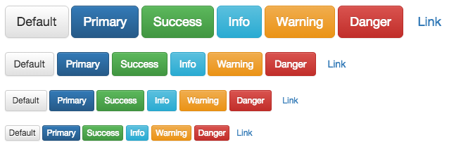

# Buttons

参考文件主要是`buttons.less` & `button.js` & `mixins/buttons`

主要效果有:

* 间距设置
    
        padding: @padding-vertical @padding-horizontal;
        font-size: @font-size;
        line-height: @line-height;
        border-radius: @border-radius;

    这里的属性值设置都在`variables.less`中
* 按钮阴影设置
    这里的阴影指的是边框边边上的小阴影(很难看到,Mac几乎贴上去才看到有/无的效果)
        box-shadow: inset 0 1px 0 rgba(255,255,255,.15), 0 1px 1px rgba(0,0,0,.075);
    1. `inset`表示为内阴影,
    2. 阴影水平偏移值(\*+-) 阴影垂直偏移(\*+-) 阴影模糊值 阴影尺寸 阴影颜色
    3. `box-shadow`可参考<http://css.doyoe.com/>
* `hover`,`active`时按钮有阴影
    
         background-color: darken(@background, 17%);
         border-color: darken(@border, 25%);
* 圆角设置
* 点击了按钮之后,边框出现蓝色,失去焦点后才消失
* 按钮内文字不可选

        user-select: none;

