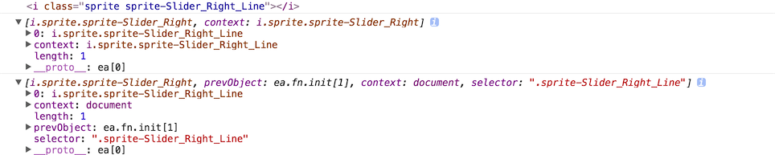

# Error

#1. .bind/.on的hover坑

.bind和.on是不支持hover事件的.例如

```javascript
function hover_change_class($selector,class_change,class_default){
    $selector.on('hover',function(){
        console.log(this);
        console.log($(this));
        console.log($selector);
        $selector.toggleClass(class_change);
        $selector.toggleClass(class_default);
    });
}
```
上述事件不会触发hover事件,很简单,它不像专门的.hover()方法,可以设置1 or2个匿名函数,这样可以控制鼠标进入和移走的两个触发事件,所以要下面这么写.

```javascript
function hover_change_class($selector,class_change,class_default){
    $selector.on('mouseenter mouseleave',function(){
        console.log(this);
        console.log($(this));
        console.log($selector);
        $selector.toggleClass(class_change);
        $selector.toggleClass(class_default);
    });
}

我在函数里加几个`console`干嘛,我是想看一下在函数里使用this和$(this)和专门的jquery选择权有何区别
```



第一行返回`<i>`标签比较好理解,因为的i标签绑定了事件,所以是i标签调用这个方法的,所以this为i标签

第二三次输出其实类似,后者选择器多了一些选择器的方法

