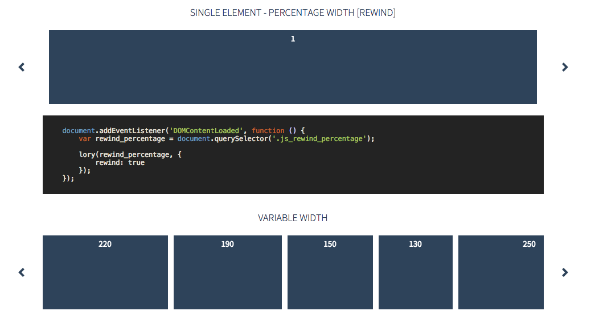

# 基本使用

预览图


##1. 下载插件

`git clone git@github.com:meandmax/lory.git`

把`lory/demo/js/lory.js`和`lory/demo/vendor/highlight.js`放到项目中.

##2. 大概的html结构

```html
 <div class="slider js_slider">
    <div class="frame js_frame">
        <ul class="slides js_slides">
            <li class="js_slide">1</li>
            <li class="js_slide">2</li>
            <li class="js_slide">3</li>
            <li class="js_slide">4</li>
            <li class="js_slide">5</li>
            <li class="js_slide">6</li>
        </ul>
    </div>
</div>
            
```

第一层`js_slider`的作用是把轮播框架整体定位.
