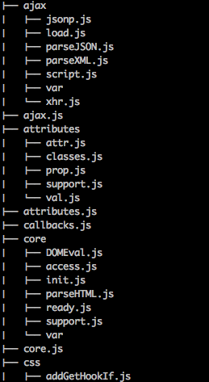

# jQuery2.2

##1. 读前准备

1. 下载源码<https://github.com/jquery/jquery/tree/2.2-stable>
2. 阅读源码前,建议先看下CommonJS<http://javascript.ruanyifeng.com/nodejs/module.html#toc12>

##2. 通读

首先大致浏览一下目录结构

src部分有很多js和文件夹同名的文件.

