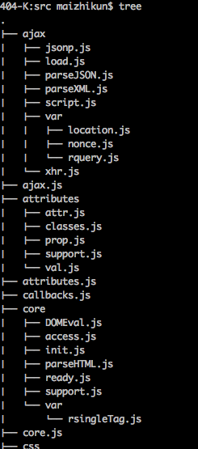

# jQuery2.2

##1. 读前准备

1. 下载源码<https://github.com/jquery/jquery/tree/2.2-stable>
2. 阅读源码前,建议先看下CommonJS<http://javascript.ruanyifeng.com/nodejs/module.html#toc12>
3. Dash等API阅读器,对着API和源码进行分析.

##2. 通读

首先大致浏览一下目录结构

src部分有很多js和文件夹同名的文件.



基本一个目录都是为同名的js提供方法的.

##有趣的点

###1. each对数组和类数组和数组的处理

what is 类数组?参考<https://segmentfault.com/a/1190000000415572>

1. 拥有length属性,且值为非负整数.
2. 不具备数组的所有方法.

一般长这样`var a = {'1':'gg','2':'love','4':'meimei',length:5};
`

jQuery对each的写法是:
```javascript
each: function( obj, callback ) {
		var length, i = 0;

		if ( isArrayLike( obj ) ) {
			length = obj.length;
			for ( ; i < length; i++ ) {
				if ( callback.call( obj[ i ], i, obj[ i ] ) === false ) {
					break;
				}
			}
		} else {
			for ( i in obj ) {
				if ( callback.call( obj[ i ], i, obj[ i ] ) === false ) {
					break;
				}
			}
		}

		return obj;
	},
```
也很好懂,类数组就直接for循环,而数组就直接`for in`

###2. trim方法

网上一堆情况前后空格换行符的方法..看jQuery怎么玩的

```javascript
rtrim = /^[\s\uFEFF\xA0]+|[\s\uFEFF\xA0]+$/g,

trim: function( text ) {
		return text == null ?
			"" :
			( text + "" ).replace( rtrim, "" );
	},
	
````

提下过滤项`\uFEFF`是UTF-8+BOM,一般JSON.parse失败很可能因为这个原因.

xA0则代表换行符等.

参考<https://imququ.com/post/bom-and-javascript-trim.html>


##额外知识点

###1. #id选择器的XSS过滤正则

```javascript
var rquickExpr = /^(?:\s*(<[\w\W]+>)[^>]*|#([\w-]+))$/;
rquickExpr.exec(selector);

```

###2. 获取数组元素负数实现

```javascript
eq: function( i ) {
var len = this.length,
	j = +i + ( i < 0 ? len : 0 );
    return this.pushStack( j >= 0 && j < len ? [ this[ j ] ] : [] );
},
```

