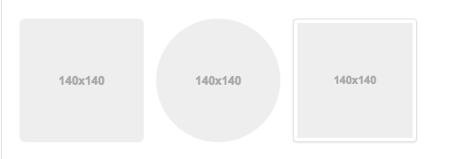

# Scaffolding

##1 全局基本设置

主要设置`Bootstrap`的前面准备工作.

    * {
      .box-sizing(border-box);
    }
    *:before,
    *:after {
      .box-sizing(border-box);
    }
    
    .box-sizing(@boxmodel) {
        -webkit-box-sizing: @boxmodel;
        -moz-box-sizing: @boxmodel;
        box-sizing: @boxmodel;
    }

所有元素都是遵循`border-box`原则

即标签设定了`width`,然后再设定`padding`和`border`都会计算在`width`以内.

    html {
      font-size: 10px;
      -webkit-tap-highlight-color: rgba(0,0,0,0);
    }
    
`-webkit-tap-highlight-color`作用于手机端,`Android`和`iOS`会有点击高亮效果,这句就表明所有点击效果都显示白色.

    
    body {
      font-family: @font-family-base;
      font-size: @font-size-base;
      line-height: @line-height-base;
      color: @text-color;
      background-color: @body-bg;
    }
设置全局字体属性和背景颜色.
    
    // Reset fonts for relevant elements
    input,
    button,
    select,
    textarea {
      font-family: inherit;
      font-size: inherit;
      line-height: inherit;
    }

常用的表单元素的字体属性都遵从父元素

##2 全局a标签设置

    a {
      color: darken(#428bca, 6.5%);
      text-decoration: none;
    
      &:hover,
      &:focus {
        color: darken(@link-color, 15%);
        text-decoration: @link-hover-decoration;
      }
    
      &:focus {
        .tab-focus();
      }
    }
    
    .tab-focus() {
      // Default
      outline: thin dotted;
      // WebKit
      outline: 5px auto -webkit-focus-ring-color;
      outline-offset: -2px;
    }

a标签主要效果

1. 设置链接颜色
2. 取消无效果的下划线
3. `foces` & `hover` 时颜色加亮,下划线出现
4. 设置`focus`时,默认定义细轮廓 点状 ,边框偏移-2px(往内)

##3 全局图片设置

    img {
      vertical-align: middle;
    }

设置图片基于父元素的中部基线
    
    // Responsive images (ensure images don't scale beyond their parents)
    .img-responsive {
      .img-responsive();
    }
    
    
    .img-responsive(@display: block) {
      display: @display;
      max-width: 100%; // Part 1: Set a maximum relative to the parent
      height: auto; // Part 2: Scale the height according to the width, otherwise you get stretching
    }
    
响应式图片,独占一行,能按比例缩小.
    
       // Rounded corners
    .img-rounded {
      border-radius: @border-radius-large;
    }

    
    // Image thumbnails
    //
    // Heads up! This is mixin-ed into thumbnails.less for `.thumbnail`.
    .img-thumbnail {
      padding: @thumbnail-padding;
      line-height: @line-height-base;
      background-color: @thumbnail-bg;
      border: 1px solid @thumbnail-border;
      border-radius: @thumbnail-border-radius;
      .transition(all .2s ease-in-out);
    
      // Keep them at most 100% wide
      .img-responsive(inline-block);
    }
    
    // Perfect circle
    .img-circle {
      border-radius: 50%; // set radius in percents
    }

