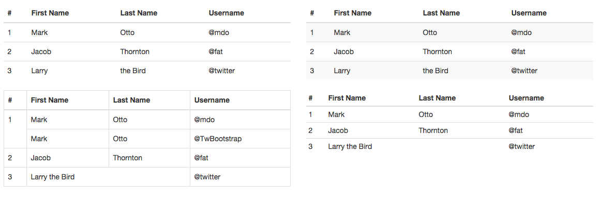

# Tables

分析下这4个表格:

1. 基本的`.table`中,样式设置了

    1. 文字左边靠齐

            text-align: left;
        
    2. 边框颜色设置        

            border-bottom: 2px solid @table-border-color;
         
2. `.table-striped`条纹表格

    note:`IE8及以下不支持:nth-chlid,该样式无效`

        .table-striped {
            > tbody > tr:nth-of-type(odd) {
                background-color: @table-bg-accent;
            }
        }
3. `.table-bordered`有边框线表格

        .table-bordered {
            border: 1px solid @table-border-color;
            > thead,
            > tbody,
            > tfoot {
                > tr {
                  > th,
                  > td {
                    border: 1px solid @table-border-color;
                  }
                }
              }
              > thead > tr {
                > th,
                > td {
                  border-bottom-width: 2px;
                }
              }
            }
     代码中设置了2次,border
    
    1. `.table-bordered`顶层定义主要为了表格最顶部的边框线
    
    2. 在`thread(表头)` & `tbody(表内容)` & `tfoot(表腿)`中都设置了剩余的边框线.
    
    当然,还设置表头的下划线粗一点,设了`2px` 
    
    表格中的`1`占了两行高度
    
            <td rowspan='2'>1</td>
            
4. `.table-condensed`紧凑的table
    
        .table-condensed {
          > thead,
          > tbody,
          > tfoot {
            > tr {
              > th,
              > td {
                padding: @table-condensed-cell-padding;
              }
            }
          }
        }

    这里面设置了间距.其具体值在`variables.less`中设定
    
        @table-cell-padding:            8px;
        @table-condensed-cell-padding:  5px;
        
    第一个值是普通的table的
    
    第二个就是紧凑的table的
    
    只是设定的`padding`不一样    

除了这四种,`Bootstrap`的`table`还有

1. `.table-hover`悬浮上去有背景颜色的

        .table-hover {
            > tbody > tr:hover {
                background-color: @table-bg-hover;
            }
        }

2. `.table`中`行`/`单元格`的颜色设置

    次样式会覆盖`tabble-hover`的效果.
    
    `.tables.less`中定义
    
        .table-row-variant(active; @table-bg-active);
        .table-row-variant(success; @state-success-bg);
        .table-row-variant(info; @state-info-bg);
        .table-row-variant(warning; @state-warning-bg);
        .table-row-variant(danger; @state-danger-bg);
        
        

