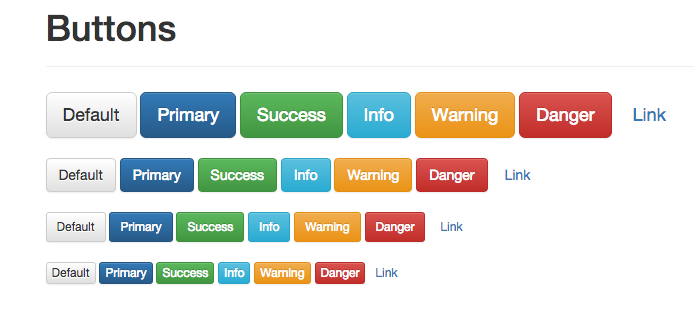

# Theme

在`theme.less`中,分析时主要参考`docs/examples/theme.html`

主要包含

1. Button
2. Image
3. Dropdown
4. Navbar
5. Alert
6. Progress Bar
7. List Group
8. Panels
9. Well
 
##1. Button

主要效果有:

1. 间距设置
2. `hover`时按钮有阴影
        @shadow: inset 0 1px 0 rgba(255,255,255,.15), 0 1px 1px rgba(0,0,0,.075);
3. 圆角设置
4. 点击的时候,阴影加深
5. 点击了按钮之后,边框出现蓝色,失去焦点后才消失
