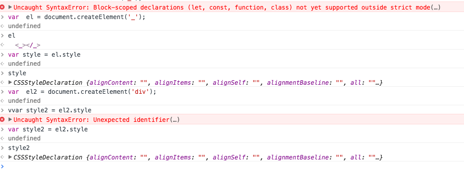

# 源码解读


###2.1. 先读utils

`utils` 主要有两个函数

`detect-prefixes.js`这是设置动画属性的,由于不同浏览器可能需要不同的动画属性.

```javascript
 let el = document.createElement('_');
        let style = el.style;

        let prop;

        if (style[prop = 'webkitTransition'] === '') {
            transitionEnd = 'webkitTransitionEnd';
            transition = prop;
        }
```

还有就是验证3d动画的可用性

```javascript
document.body.insertBefore(el, null);
style[transform] = 'translate3d(0, 0, 0)';
hasTranslate3d = !!global.getComputedStyle(el).getPropertyValue(transform);
document.body.removeChild(el);    
```

这里先创建了一个`_`元素(其实创建什么标签并不要紧),然后判断style是否含有该属性,有的话就保存到`transition`中

下面是笔者的尝试



.还有另外一个文件`ispatch-event.js`,主要的作用是兼容事件绑定,用了<https://github.com/webmodules/custom-event>的插件


